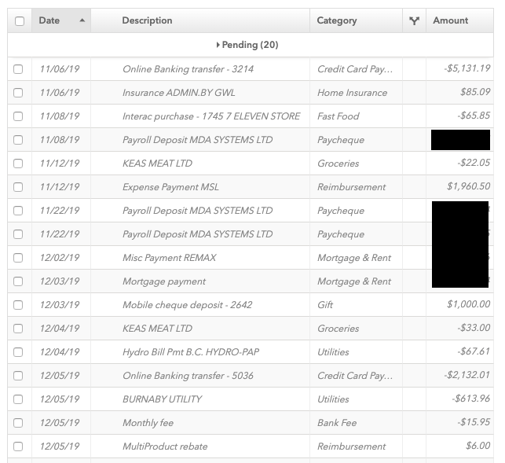

During the past year I decided to become a real adult and start learning more about personal finance to understand how I could better structure my finances
to achieve my desired goals. To analyze my expenses I decided to create a [Mint](www.mint.com) account. For those not familiar with [Mint](www.mint.com), it is an app and 
website that connects to your financial accounts and displays them all in one place. It also has nifty features like the ability to auto-categorize transactions, which is what I was most interested in.  

There was one problem, after connecting all my accounts to [Mint](www.mint.com) I was only seeing the last 3 months of transactions when I expected to see many years worth. I quickly found
[this](https://help.mint.com/Accounts-and-Transactions/888963071/How-can-I-get-transactions-older-than-90-days.htm); financial institutions only provide 3 
months of previous transactions to [Mint](www.mint.com). This was unfortunate because the only transactions I could see were starting in March 2020, when COVID-19 took grasp of the world
and forced many countries into isolation. So naturally, my expenses for these 3 months were not indicative
of my regular expenses. 

I decided to investigate how I could get older transactions into [Mint](www.mint.com). I quickly found out there was no good way to do this.

### The Problem with Mint

[Mint](www.mint.com) allow users to [add transactions manually](https://help.mint.com/Accounts-and-Transactions/888960761/How-do-I-add-manual-transactions.htm)
but I had hundred of transactions to add, I wasn't going to manually enter all of them. [Mint](www.mint.com) provides no way to upload a batch of transactions.

However, when you manually create a transaction in [Mint](www.mint.com), a simple HTTP POST request with a cookie, form-data, and a token is sent by the browser to [Mint](www.mint.com).
I could write a script to automatically do this for a bunch of my transactions...

### The Problem with my Bank

Now that I knew I could write a script to upload transactions to [Mint](www.mint.com), how would I get old transactions from my bank? Older transactions were
contained in statements that I could download in PDF format. Unfortunately PDFs are notoriously difficult for computer programs to read as they do not contain structured data, like
HTML or JSON.

However, if I could convert the PDF statements to CSV files, then my script could read the CSV file and for each line send a 
request to [Mint](www.mint.com) to create a transaction.

### The Solution

Enter a service called [DocParser](www.docparser.com)! After a lot of searching I found this platform which provides the ability to parse PDFs into structured data
and send that data to services of your choice. In my case, I could upload a bank statement, have the transactions parsed into a table, then have a webhook send an
HTTP POST request to [Mint](www.mint.com) for each transaction. Here is how I did it.

### Step 1 - Create Initial Document Parser

The way DocPaser works is that you upload a PDF document and use it as a template to setup parsing rules. After setting up your parser you are able
to upload PDF documents that follow the same format and have them parsed. Docparser has a free trial that allows you to parse a certain number of PDFs
that you can easily sign up for.

1. Create a new parser

2. Select the type of document you want to parse, in my case I selected "Bank Statements"

3. You'll then be prompted to upload a sample bank statement.

4. Create your first parsing rule by creating the column boundaries in your bank statement. Docparser will use these boundaries to convert the statement from its PDF form to a table.
I blacked out a few transactions just for a little privacy.

5. Now you can add filters to refine the produced table. In my case I first filtered the table to start when column 2 contains "Opening Balance" and when column 2 does not have a value.
This removed all the rows that did not correspond to the transactions in my statement. I then fixed up the date column by setting the value of empty cells to the value of the previous row. 
Then, I formated the date column to be m/d (11/06) instead of d M (6 Nov), this would make the date easier to use when it came time to create the webhook. The last filtering step was to
add column titles to each column; Date, Description, Withdrawals, Deposits, and Balance. The screenshot below shows the final table data after all filters were applied.

### Step 2 - Refine Document Parser

Unfortunately, after creating the initial document parser there were still some issues. First, my bank statement did not include the year in the date of each transaction. I would need to know
the year when creating the webhook. Second, the statement I uploaded contained 2 pages, and the transaction table on the second page did not line up with the first page, so no transactions
on the second page were parsed.

1. The year of the statement could be extracted from the first page of the statement in the top right corner. I created a second parsing rule to extract just the year from the statement.

2. Getting page 2 transactions proved to be simple. I create a third parsing rule almost identical to the first, but had different column boundaries, and different start and end conditions.
I setup the column boundaries to follow the transaction table on the second page. Then I updated the table filter to start when column 1 contains "Date" and end when column 2 contains "Closing".

3. I created a final parsing rule to merge the two tables produced by the parsing rules I created for pages 1 and 2.

### Step 3 - Create Webhook

Now all I had to do was use the data I parsed from my bank statement to form HTTP POST requests to [Mint](www.mint.com).
Luckily, Docparsers allows you to do this through integrations so I did not have to write any code for this.

1. I started by capturing the manual transaction creation request in Google Chrome using the Developer Tools. 
The Developer Tools allow you to see the request made to [Mint](www.mint.com) and copy the curl equivalent command.
I have left out the cookie that is contained in the header, in addition to the token and account number contained in the
form data (Headers fields are specified with the -H prefix, form data is the key value section below the header fields
where key-values are separated by the & character. I put each key-value on its own line so it is easier to read).
        
         curl 'https://mint.intuit.com/updateTransaction.xevent' \
           -H 'authority: mint.intuit.com' \
           -H 'pragma: no-cache' \
           -H 'cache-control: no-cache' \
           -H 'user-agent: Mozilla/5.0 (Macintosh; Intel Mac OS X 10_15_1) AppleWebKit/537.36 (KHTML, like Gecko) Chrome/81.0.4044.129 Safari/537.36' \
           -H 'x-requested-with: XMLHttpRequest' \
           -H 'content-type: application/x-www-form-urlencoded; charset=UTF-8' \
           -H 'accept: */*' \
           -H 'origin: https://mint.intuit.com' \
           -H 'sec-fetch-site: same-origin' \
           -H 'sec-fetch-mode: cors' \
           -H 'sec-fetch-dest: empty' \
           -H 'referer: https://mint.intuit.com/transaction.event' \
           -H 'accept-language: en-US,en;q=0.9' \
           mtCashSplit=on&
           mtCheckNo=&
           tag1597252=2&
           tag1572535=0&
           tag1572536=0&
           tag1572537=0&
           task=txnadd&
           txnId=%3A0&
           mtType=pending-other&
           mtAccount=0&
           symbol=&
           note=&
           isInvestment=false&
           catId=20&
           category=Uncategorized&
           merchant=Test%20Transaction&
           date=06%2F09%2F2020&
           amount=12.12&
           mtIsExpense=true&
           mtCashSplitPref=1&
           --compressedd

	For every transaction from my bank statement, I would need to send a similar request, but modify the `merchant`, `date`, `amount`, and
	`mtIsExpense` fields in the form data. It is important to note that `mtType=pending-other`, indicating that this transaction is a pending
	transaction from one of your bank accounts, and mtType should be set to the particular account number that the transaction corresponds to.

2. I created a new integration in DocParser and selected an Advanced Webhook. 

3. I setup the Advanced options to follow the curl request. By setting "Repeating Data Behaviour" to "One request per row" the integration would send one
request to [Mint](www.mint.com) for every row in the parsed table. I also added all the headers from the captured request.

	

4. I set merchant, date, and amount fields in the form data to data that was parsed
from my bank statements. Data from the merged table produced by my parsing rules could be accessed by using the following syntax, `{{merged.<field name>}}` and
the year I parsed from the statement could be accessed through `{{year_of_statement}}`. The initial body payload in the webhook describes all the data values
that are accessible when setting up the webhook. Here is the final webhook setup. I will describe how it works below.

	

	1. The easiest field to set was `merchant` which is equivalent to the `description` column in the parsed tables. Setting `merchant` to `{{merge.description}}` would do the trick.

	2. Setting the `date` involved using the `date` column of the parsed tables, and also the year parsed from the statement. Setting date to `{{merge.date}}%2F{{year_of_statement}}`
would produce a result that looked like 01/02/2019. The %2F is the encoded version of /.

	3. Finally, the amount field could be set. Unfortunately, we have 2 columns to choose from in the parsed merged table, either deposits or withdrawals. This is further complicated by the fact that
the form has an additional field, `mtIsExpense`, that should be `false` for deposits and `true` for withdrawals. So I decided to create two webhooks, one for withdrawals that would set
`amount` to `{{merged.withdrawls}}` and `mtIsExpense` to `true` and another one for deposits that would set `amount` to `{{merged.deposits}}` and `mtExpense` to `false`.

### Step 3 - Upload Documents for Processing

Now came the moment of truth. Time to upload some other statements and see if the parsing and webhook would cause my bank statement transactions to show up in [Mint](www.mint.com).

1. I selected "Imported Documents" and uploaded some bank statements. This caused parsing and integration of the statement to be queued. Once the statement
was processed it will appear in the "Processed" tab. 
2. I selected the document to check the results of processing. You can see the parsed data, including the tables and the parsed year of the statement.
	
	
3. Then you can go to the webhooks tab an view all the requests that were sent. As you can see each request has a successful response code.
	
	
4. Now comes time to check the transactions in [Mint](www.mint.com). Logging into [Mint](www.mint.com) and sorting transactions by time you will see all your transactions from your bank statements! Viola! In my case the bank statement I added was from 2019.

	

### More Work to be done

There is still one issue. The uploaded transactions are not categorized. My webhook set the category of each transaction to be "Uncategorized" because there was no way to get
this information from my bank statement. I manually edited the category after they were uploaded. [Mint](www.mint.com) can only automatically categorizes transactions that it
retrieves from your bank. SIGH! I will be leaving this as an open problem for now. I have some ideas on how this could be done, but this could be a good topic for another post.
If anyone has any ideas, feel free to send me an email!

