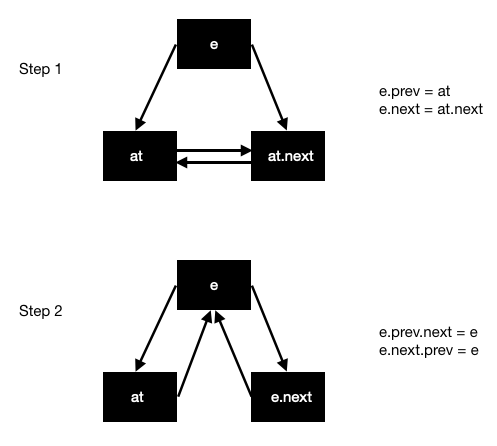

For educational purposes, I recently took a stab at implementing a doubly linked-list in Go. 
I quickly stumbled upon the container/list package provided by the Go standard library that implements
a generic doubly-linked list. The standard library implementation was much better than my own and I learned a few things from
it. Here I will do a deep dive into the container/list package focusing on its design, nifty tricks it
has employed, and how it was tested. Specificy I will describe the exported data types, how 
initialization works, how to insert and iterate, and how the package was tested.

First a breif description of linked-lists. A linked-list is a data structure that provides a collection of data elements, whose order is
not determined by placement in memory (like arrays). Instead, each element of a linked-list points to the next. 
Each element simply contains data and a pointer to the next element. In the case of a 
doubly linked-list, each element also contains a pointer to the previous element. This allows the
list to be iterated in both forward and reverse directions. I won't get into why you would use a linked-list over 
an array or slice, if you are interested in this topic Google will provide you many answers. Let's first
look at the exported data types that the container/list package provides.

### Exported Types

Go's implementation of a doubly-linked list can be found [here](https://github.com/golang/go/blob/master/src/container/list/list.go).
There are two fundamental types exported by the package, `Element` and `List`. 

The `Element` struct below represents the element type that can be stored in a list. It contains
pointers to the `next` and `prev` elements in the list. Also, it contains a pointer to the `list`
it belongs to and of course the `Value` the element is storing. Note that `Value` is exported
so users can easily get access to the data contained within an `Element`. The other fields
are not exported, but more on this later.

```
type Element struct {
	next, prev *Element
	list *List // The list to which this element belongs.
	Value interface{} // The value stored with this element.
}
```

The `List` struct below represents the doubly-linked list. It contains two fields, a `root` element
and `len`, the length of the list. 

```
type List struct {
	root Element // sentinel list element, only &root, root.prev, and root.next are used
	len  int // current list length excluding (this) sentinel element
}
```
The comments refer to `root` as the "sentinel" element which means it is used to track the first and last element of the list.
The `root` field is a struct, so each time a `List` is created, a zero-valued `root` will also be created. This is important; every `List` will always
contain a root element.

The reason there is a field for the length of the list is so the list does not need to be iterated
every time a user wants to know the length. This makes returning the length O(1) instead of O(n).

Great, so now we understand the simple data structures used to implement the linked-list. But what
type of data can a `List` hold? Is it strongly typed like an array or slice? The answer is no. 
If we look at the `Element` definition, we can see that the `Value` field is of type `interface{}`
This means that `Value` can be a type that implements the methods contained within `interface{}`.
Since there are no methods contained within `{}` every type can be used. To access data stored 
within an `Element`, we must do a type assertion on `Value`.

```
element := Element{Value: "foo"}
foo := element.Value.(string) 
```

This is pretty powerful because the Value could be a primitive type or it could even be a custom type
that the programmer defines. In other languages you could solve this problem with a language feature
known as "Generics" (templates in C++ are one example). However, Go does not have this feature. There is
a huge debate on whether Generics should be added to Go, but I won't get into that. For now, just know that
the list can hold any type of data and to access the data you need to do a type assertion. In fact, 
different elements of the list can contain different types. For instance the first element could 
hold a string and the second could hold an integer.

Let's move on to how lists are created.

### Initialization

A list should be created using the provided builder function `New()`.

`func New() *List { return new(List).Init() }`

This functions returns a pointer to a `List` and does so by executing two steps. Let's unpack what is
going on in this function. The first thing the function does is `new(List)`. The `new` keyword in 
Go returns a zero-value initialized pointer to the provided type. So in this case it returns a pointer
to a `List` where the `root` element has nil pointers for the `next` and `prev` fields, a nil
pointer to the `list` it belongs to and an unspecified `Value`. The second step is calling `Init()` on
the zero-valued `List` pointer.

```
func (l *List) Init() *List {
	l.root.next = &l.root
	l.root.prev = &l.root
	l.len = 0
	return l
}
```

Currently, the `List` is empty so the `Init` function sets `next` and `prev` elements to the `root`
itself, and sets the length of the list to 0. The length is already 0, but it is explicitly set here
in case someone wants to use `Init` to reset a list that was not empty.

### Lazy Initialization

What happens if someone creates a list like `l := List{}` and tries to use it? Well, `Init()` 
won't be called and the list will not be ready for use. However, the authors of this package
were smart and implemented lazy initialization, so this is not a problem. 

```
func (l *List) lazyInit() {
	if l.root.next == nil {
		l.Init()
	}
}
```

In any function that modifies the list, `lazyInit()` is the first thing that is called. It checks
if the next element of the `root` is `nil` and if so perform initialization. This works because
`root` is only `nil` if `Init()` was not called.

### Insertion

How do we add elements into the list? The package provides 4 methods for adding single elements to
the list; `PushFront`, `PushBack`, `InsertBefore`, and `InsertAfter`. Under the hood the functions
rely on a single helper function called `insert`. Let's see how this works.

```
func (l *List) insert(e, at *Element) *Element {
	e.prev = at
	e.next = at.next
	e.prev.next = e
	e.next.prev = e
	e.list = l
	l.len++
	return e
}
```

This function will insert `e` after `at`, returning `e`. What it needs to do is break existing links
between `at` and the next element and reconstruct links so that `e` is between `at` and 
the next element. The diagram below explains this process two step process.



With `e` inserted after `at`, the `list` the element belongs to is set to this list and the length
of the list is incremented.

Now, let's look at some exported insert functions and how they use the insert function. Let's take
`InsertBefore` as an example.

```
func (l *List) InsertBefore(v interface{}, mark *Element) *Element {
	if mark.list != l {
		return nil
	}
	// see comment in List.Remove about initialization of l
	return l.insertValue(v, mark.prev)
}
```

It inserts a new element with a value of `v`, before the `mark` element, only if `mark` belongs
to this list. The signature of this function takes in `v` as an `interface{}` not an `Element`. 
So `v` must first be used to construct a new `Element`, which then can be inserted into the list. This
is what the helper, `insertValue` does.

```
func (l *List) insertValue(v interface{}, at *Element) *Element {
	return l.insert(&Element{Value: v}, at)
}
```

This function simply takes `v`, stuffs it into a new `Element` and then calls `insert`.

In order to insert `v` before `mark`, we need to pass `mark.prev` to the `insertValue` function
because `insert` inserts a provided element AFTER `at`. Another important thing to realize is that `InsertBefore` returns a pointer to the inserted element. 
This will become useful when testing these types of functions.

### Iterating the list

Now that we understand many of the building blocks of the list we can finally see how the list can
be iterated. Let's construct the 3 parts of a for loop, one at a time.

The first part of a for loop is initialization. This is where we declare and initialize a variable
that will be modified on every iteration. To iterate through the list, we need access to the first
element. This is easy enough.

```
for e := l.Front(); _; _ {
	// do something
}
```

Under the hood, `l.Front()` returns `l.root.next`, the first element of the list. Similarily,
`l.Back()` returns `l.root.prev`, the last element of the list.

Second, we need to define the stop condition. We want to stop iterating after we have reached the 
last element, or in other words, when we get to the sentinel `root` element. The `root` element is not
exported so there isn't a way to do this check explicitly. Lets, pause this for now and look at the
third part of the loop, how we change the variable.

For each iteration we want `e` to be the next element, which we can do using `e.Next()`.

```
func (e *Element) Next() *Element {
	if p := e.next; e.list != nil && p != &e.list.root {
		return p
	}
	return nil
}
```

This function should just return `e.next` right? Why does it look more complicated? Well, it does
indeed return `e.next`, but it only does so if `e.next` does not equal the `root` element. If it
does equal the `root` element then the function instead returns `nil`. AHA! Using this information
we can define the stop condition of the loop that we were stuck on to be `e != nil`.

```
for e := l.Front(); e != nil; e = e.Next() {
	// do something with e
}
```

How nice is that! Applying the same principles the list can be iterated in the reverse direction.

```
for e := l.Back(); e != nil; e = e.Prev() {
	// do something with e
}
```
This is pretty cool stuff if you ask me! Let's move on to how the authors of this package tested
the list.

### Testing the list

As you would expect, there is a test file called list_test.go that contains the tests for the
list package. I will not get into every test, but I will describe the helper functions that were
employed to make testing lists much easier. There are two helpers, `checkListLen` and 
`checkListPointer`. 

`checkListLen` is pretty simple, given a list and the expected length, check that the list matches
that length. I won't even show the code for this because it is so simple.

`checkListPointer` is where the real magic happens. The signature of the function is below.

`func checkListPointers(t *testing.T, l *List, es []*Element)`

It takes in a pointer to a list, `l` and a slice of pointers to elements `es` and ensures that the
list contains the elements in the same order and size of `es`. So each time this function is called
the size of the list is checked using `checkListLen`, then the list is iterated to check that the
pointers of each element follow the provided slice of elements.

Let's break down the for loop where this magic happens. We'll start with the first half of the 
for loop.

```
root := &l.root

// ...

for i, e := range es {
	prev := root
	Prev := (*Element)(nil)
	if i > 0 {
		prev = es[i-1]
		Prev = prev
	}
	if p := e.prev; p != prev {
		t.Errorf("elt[%d](%p).prev = %p, want %p", i, e, p, prev)
	}
	if p := e.Prev(); p != Prev {
		t.Errorf("elt[%d](%p).Prev() = %p, want %p", i, e, p, Prev)
	}
```

Here we are looping over the provided slice of elements, `es`. For the first element `e`, we expect
the previous element to the be `root` (stored in variable `prev`) and we expect the call to 
`e.Prev()` to return `nil` (stored in variable `Prev`). For the rest of the elements we expect the 
previous element to be the previous element in the slice (`es[i-1]`) and we expect the call to `e.Prev()` to also be this value.

The second part of the loop is analogous to the first but it instead checks the next element.

```
root := &l.root

// ...

for i, e := range es {

	// ...

	next := root
	Next := (*Element)(nil)
	if i < len(es)-1 {
		next = es[i+1]
		Next = next
	}
	if n := e.next; n != next {
		t.Errorf("elt[%d](%p).next = %p, want %p", i, e, n, next)
	}
	if n := e.Next(); n != Next {
		t.Errorf("elt[%d](%p).Next() = %p, want %p", i, e, n, Next)
	}
}
```

Here `next` is the expected next element which for the last element is `root` and for other elements
is the next element in the list, `es[i+1]`. `Next` is the expected return value of `e.Next()` which
for the last element is `nil` and for the others is the same as `next`. The function then simply
compares `e.next` to `next` and `e.Next()` to `Next` (as is done in the first part of the loop 
as well).

This function is super helpful because test functions become trivial to write. Below is an example
test that creates a new list, then adds 4 elements to the list. Whenever we want to check the
validity of the list, we just call `checkListPointers` and pass in a slice of elements in the
order they are expected to be in within the list. Here we can also see that because the `PushFront`
and `PushBack` functions return pointers to the inserted element, the slice to pass to the
`checkListPointers` function is very easy to construct.

```
func TestList(t *testing.T) {
	l := New()
	checkListPointers(t, l, []*Element{})
	e2 := l.PushFront(2)
	e1 := l.PushFront(1)
	e3 := l.PushBack(3)
	e4 := l.PushBack("banana")
	checkListPointers(t, l, []*Element{e1, e2, e3, e4})
}
```

### Summary

I hope this was a useful walk through of the container/list package. I showed the data structures
used by the list, how the list is initialized, how insertation works, how to iterate
and how the package is tested. I am pretty impressed with the elgance and simplicity of the
implementation and look forward to diving into more standard library implementations in the future.
If you found this post useful or found any errors please email me at <johnbuonassisi@gmail.com>. Until
next time, `os.Exit(1)`.


